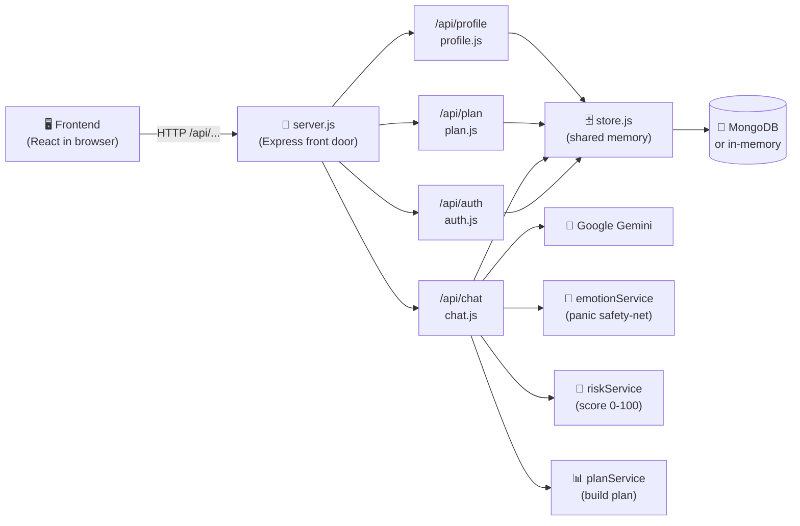
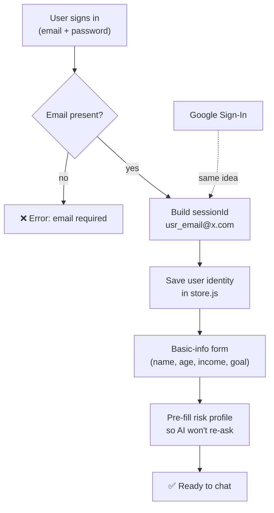
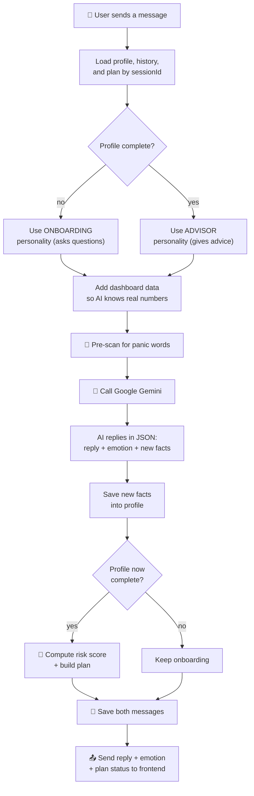
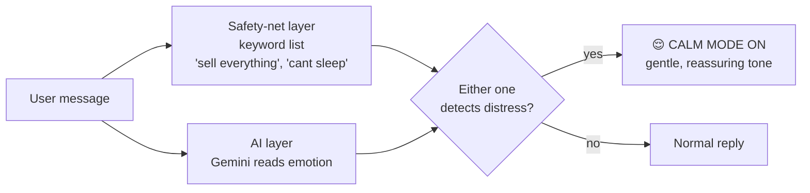
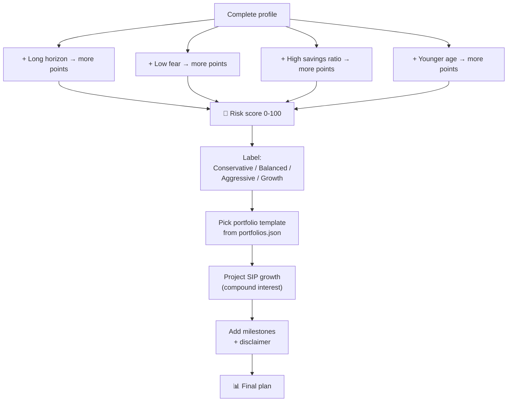
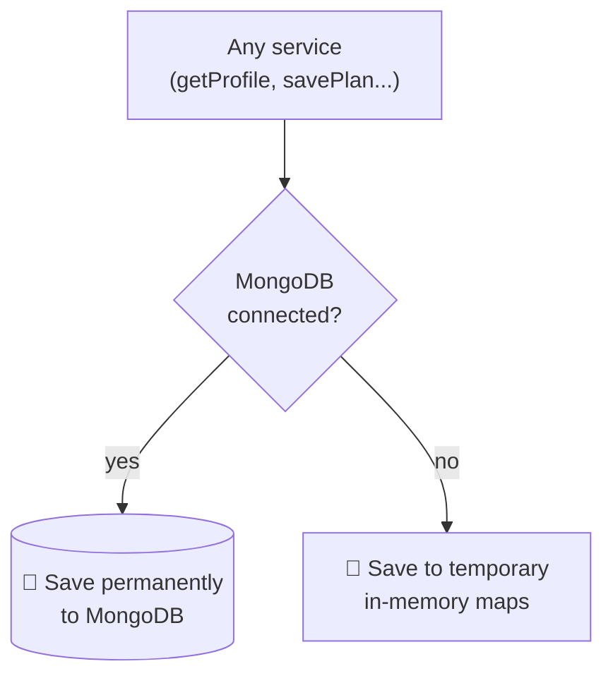

# NiveshMitra Backend — Flow Diagrams 🪙

A simple visual guide to how the backend works. Share this with the team.

> The frontend (browser) just sends messages to the backend and shows back what it
> returns. The backend is the **brain + memory** of the app.

---

## 1. High-level architecture

The whole system at a glance — who talks to whom.

---

## 2. The 4 route "departments"

Every request from the frontend goes to one of these.

| URL prefix     | File         | Job                               |
| -------------- | ------------ | --------------------------------- |
| `/api/auth`    | `auth.js`    | Login & save user details         |
| `/api/chat`    | `chat.js`    | The main conversation (the heart) |
| `/api/plan`    | `plan.js`    | Read the investment plan          |
| `/api/profile` | `profile.js` | Read saved profile / chat history |

---

## 3. Login flow (auth.js)

How a user gets a stable identity that their history "follows."

- The `sessionId` is the **key to everything** — all chats, profile, and plan are stored under it.
- Password isn't really checked (demo gate). Any non-empty value works.

---

## 4. Chat flow — the heart of the app (chat.js)

What happens on **every single message**.

---

## 5. Hybrid panic detection (emotionService.js) — flagship feature

Two layers decide if **Calm Mode** turns on.

> **Why two layers?** AI can be unpredictable. The keyword list **guarantees** Calm Mode
> triggers on demo day, no matter what the AI does.

---

## 6. Risk scoring → plan building (riskService.js + planService.js)

Pure math, **no AI** — turns a profile into a personalized plan.

---

## 7. Storage (store.js) — the shared notebook

Same functions work whether or not a database is connected.

> The fallback means the demo **never hard-crashes**, even without a database.

---

## One-line summary

> The frontend talks to an **Express server**. Every message goes through **chat.js**, which
> loads the user's memory, runs a **panic-detector**, asks **Google Gemini** for a reply,
> learns new facts about the user, and once it knows enough, runs a **math-based risk score**
> to **auto-build a personalized investment plan** — all saved under the user's login ID in
> **MongoDB** (or memory as backup).
